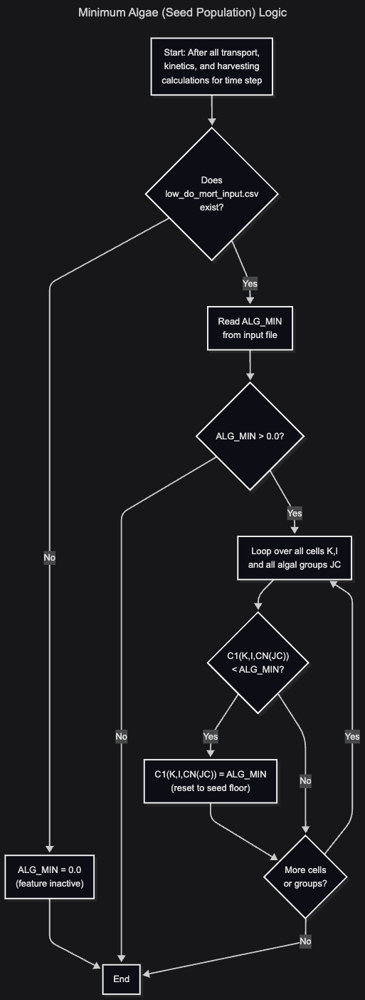



# Chapter 3: Minimum Algae (Seed Population)

## Purpose

Prevents algal concentrations from dropping below a minimum "seed" value. This feature ensures that a residual population persists for regrowth after die-off events such as [hypoxic mortality](/hab-modeling/low-do-mortality/) or [harvesting](/hab-modeling/algal-harvesting/).

## Activation

Place `low_do_mort_input.csv` in the model run directory and set the `ALG_MIN` parameter to a value greater than zero. If the file does not exist, CE-QUAL-W2 defaults `ALG_MIN` to `0.0` and the feature has no effect.

## How It Works

After CE-QUAL-W2 completes all transport, kinetics, and harvesting calculations for a time step, the model checks every cell for every algal group:

```
IF (C1(K,I,CN(JC)) < ALG_MIN) C1(K,I,CN(JC)) = ALG_MIN
```

If the algal concentration in a cell falls below `ALG_MIN`, CE-QUAL-W2 resets the concentration to `ALG_MIN`. The model applies this floor uniformly to all algal groups and all cells. `ALG_MIN` is a single scalar value and cannot vary by group.

## Parameters

| Parameter | Units   | Per-group? | Description                                          |
| --------- | ------- | ---------- | ---------------------------------------------------- |
| `ALG_MIN` | mg L⁻¹ | No         | Minimum algal concentration. Set to `0.0` to disable. |

## Input File Format

The `ALG_MIN` parameter is specified in `low_do_mort_input.csv`, which also contains the low DO mortality parameters. See [Chapter 4: Low DO Mortality](/hab-modeling/low-do-mortality/) for the complete file format and an inline listing of the example file.

## Source Code References

- **Read input:** `input.F90` ~lines 2308--2317 -- CE-QUAL-W2 initializes `ALG_MIN` to `0.0` at line 2311, then checks whether `low_do_mort_input.csv` exists. If the file is present, CE-QUAL-W2 opens it and reads `ALG_O2LIM` and `ALG_MIN` from the third line (line 2317). If the file is absent, `ALG_MIN` remains `0.0` and the feature is inactive.

- **Applied:** `update.F90` ~line 120 -- After all transport, kinetics, and harvesting updates are complete for each algal group in each cell, CE-QUAL-W2 checks whether the resulting concentration `C1(K,I,CN(JC))` is less than `ALG_MIN`. If so, the model resets the concentration to `ALG_MIN`, ensuring that a minimum seed population is maintained for potential regrowth.

## Algorithm Flowchart




