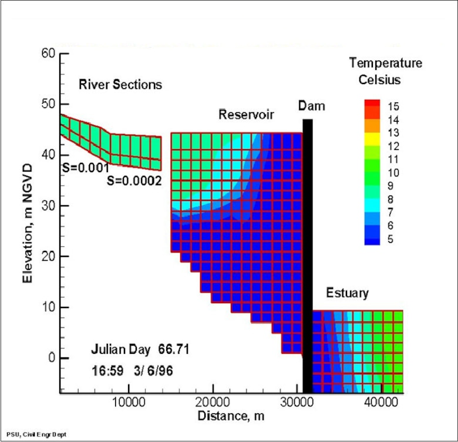

# CE-QUAL-W2

## A Two-Dimensional, Laterally Averaged, Hydrodynamic and Water Quality Model

CE‐QUAL‐W2[^1] is a two‐dimensional (2D), longitudinal/vertical, hydrodynamics and water quality model that simulates the vertical and longitudinal dynamics and changes in reservoirs, lakes, and other thermally stratified water bodies. CE-QUAL-W2 is developed and maintained by the Environmental Laboratory, Engineer Research and Development Center (ERDC), U.S. Army Corps of Engineers (USACE). USACE and other organizations around the world, including federal, state, and local agencies and universities) have developed more than 1,100 CE-QUAL-W2 water quality model applications for reservoirs, lakes, rivers, and estuaries. These models help generate fundamental insight into current and future reservoir and river system flow and water quality conditions, aiding environmental impact assessments, reservoir operations decision-making, and the planning, design, and evaluation of water resources systems and infrastructure.

### Key Features

- **Hydrodynamics**: Simulates water surface elevations, velocities, and temperature
- **Water Quality**: Models nutrients, algae, dissolved oxygen, organic matter, pH, and multiple generic constituents
- **Flexible Grid**: Variable segment lengths and layer heights
- **Multiple Waterbodies**: Can link rivers, lakes, reservoirs, estuaries, and river basins
- **Well-Tested**: Applied to hundreds of water bodies worldwide over 45+ years

### Quick Start

1. [Download CE-QUAL-W2](/downloads/) - Get the latest version
2. [Read the Documentation](/documentation/) - Complete user manual and theory
3. [View Examples](/examples/) - Sample applications and test cases
4. [Get Support](/support/) - User forum and contact information

### Latest Release

**CE-QUAL-W2 Version 4.5** 
- Enhanced numerical stability
- Improved water quality algorithms
- Updated utilities and preprocessors
- Comprehensive documentation

### Typical Applications

CE-QUAL-W2 has been applied to:
- **Reservoirs**: Stratification, selective withdrawal, dam operations
- **Rivers**: Temperature modeling, dissolved oxygen, nutrient transport
- **Lakes**: Eutrophication, algae dynamics, restoration scenarios
- **Estuaries**: Salinity intrusion, tidal dynamics, water quality
- **River Basins**: System-wide water quality management

|  |
|--|
| Longitudinal view of temperature output for a riverine section, reservoir, and estuary, from a CE‐QUAL‐W2 model application. |

### Past Studies

* The reservoir WQ model of choice throughout the U.S. and many other countries
* The 2-D, longitudinal/vertical hydrodynamic and water quality model of choice for the following agencies:
    * U.S. Army Corps of Engineers (USACE)
    * U.S. Geological Survey (USGS)
    * U.S. Department of the Interior, Bureau of Reclamation (USBR)
    * U.S. Environmental Protection Agency (U.S. EPA)
    * Tennessee Valley Authority (TVA)
* More than 300 applications worldwide
* Recent applications of W2 were developed for the following projects:
    * Columbia River System Operation (CRSO) Project - FY16 to FY20
        * Columbia River
            * Grand Coulee Dam (Lake Roosevelt)
            * Bonneville Lock and Dam (Lake Bonneville)
            * The Dalles Dam
            * Chief Joseph Dam (Rufus Woods Lake)
            * McNary Dam (Lake Wallula)
        * Snake River
            * Lower Granite Lock and Dam (Lower Granite Lake)
            * Lower Monumental Lock and Dam (Lake Herbert G. West)
            * Little Goose Lock and Dam (Lake Bryan)
            * Ice Harbor Lock and Dam (Lake Sacajawea)
        * Clearwater River
            * Dworshak Dam (Dworshak Reservoir)
    * Columbia River Treaty (CRT) - FY13 to FY20
        * Columbia River
            * Grand Coulee Dam (Lake Roosevelt)
            * Bonneville Lock and Dam (Lake Bonneville)
            * The Dalles Dam
            * Chief Joseph Dam (Rufus Woods Lake)
            * McNary Dam (Lake Wallula)
        * Snake River
            * Lower Granite Lock and Dam (Lower Granite Lake)
            * Lower Monumental Lock and Dam (Lake Herbert G. West)
            * Little Goose Lock and Dam (Lake Bryan)
            * Ice Harbor Lock and Dam (Lake Sacajawea)
        * Clearwater River
            * Dworshak Dam (Dworshak Reservoir)
    * Applegate Lake – FY14
    * Lost Creek Lake – FY13
    * Tygart Dam and Lake - FY13
    * Lehigh River - FY12
    * Cougar Reservoir - FY12
    * Clarion River Piney Reservoir - FY09
    * Minnesota River - FY08
* Cited in more than:
    * 15 PhD dissertations
    * 50 Master’s theses
    * 100 presentations at scientific meetings
    * 20 journal articles worldwide
* Portland State University (PSU) reports the following statistics for CE-QUAL-W2 on their website:
    * 3 - 4 model downloads per day from around the world (approximately 1,500 model downloads per year)
    * 10 - 30 visitors to their web site per day (approximately 7,000 visitors per year)

## CE-QUAL-W2 Model Capabilities (Version 4.5)

The CE-QUAL-W2 model incorporates the following water quality considerations: Longitudinal-vertical hydrodynamics and water quality in stratified and non-stratified systems, nutrients-dissolved oxygen-organic matter interactions, fish habitat, selective withdrawal from stratified reservoir outlets, hypolimnetic aeration, multiple algae, epiphyton/periphyton, zooplankton, macrophyte, CBOD, sediment diagenesis model, and generic water quality groups, internal dynamic pipe/culvert model, and hydraulic structures (weirs, spillways) algorithms. The hydraulic structures algorithms include submerged and two-way flow over submerged hydraulic structures as well as a dynamic shading algorithm based on topographic and vegetative cover.

CE-QUAL-W2 includes variable density as affected by temperature, salinity, Total Dissolved Solids (TDS), and Total Suspended Solids (TSS) to simulate stratified flow. There are 28 water quality constituent state variables, and any combination of constituents can be included or excluded from a simulation. The effects of salinity or total dissolved solids/salinity on density, and thus hydrodynamics, are included only when simulated in the water quality module. The water quality algorithm is modular, allowing constituents to be easily added as additional subroutines.

Many new features and enhancements can be utilized in the current model release, Version 4.5, including executables, source codes, and examples for the model and preprocessor. A stand-alone V4 GUI preprocessor is included as part of the download package. A post-processor for W2 model output has been used since the V3.7 model by the DSI, Inc. group, and an Excel macro utility aids the model user in writing out files compatible with CE-QUAL-W2.

The latest version (4.5) includes many new features and upgrades and is not file compatible with earlier versions because of many new variables in the control file. Differences between versions are shown in Part 5 of the User Manual. The new model includes the following features, developed by Portland State University, with support by ERDC Environmental Laboratory and Portland District of U.S. Army Corps of Engineers for the development of many of these enhancements):

1. Atmospheric deposition of any state variable - model user provides mass loading to waterbodies. There is now no need to specify a flow, temperature, and concentration file since only a time series of mass per area per time is used as an input.
2. Ability to specify directly output of flow balance file, N and P mass balance file, water level file
3. New generic constituent source: sediment release
4. New state variables: water age, N2, dissolved total gas pressure, bacteria, CH4, Fe(II), FeOOH, Mn(II), MnO2, H2S. Many of these before were only operative using sediment diagenesis as generic constituents or were recommended generic constituents.
5. New derived variables: turbidity (correlated to TSS), Secchi disk (based on light extinction), un-ionized ammonia (based on temperature, pH, and total ammonia), and Total Dissolved Gas (TDG).
6. Ammonia volatilization is computed based on unionized ammonia volatilization rate and is a derived variable. pH must also be active as a derived variable.
7. Implementation of variable algal settling velocity including buoyancy effects from Overman (2019). This allows for predicting the variable velocity of cyanobacteria allowing for rise and fall of the cells during the day and night.
8. Zooplankton settling is a new zooplankton parameter.
9. Implementation of algal toxin production based on Garstecki (2021)
10. Ability to generate lake contours easily (elevation vs time for temperature and dissolved oxygen)
11. Ability to generate river contours easily (model segment or distance along river vs time) for temperature and dissolved oxygen)
12. The C groups dissolved organic C (DOC) and particulate organic C (POC) with both labile and refractory groups were added as an alternative to organic matter groups. The option is available to use either C or organic matter. This was done earlier by Dr. Zhonglong Zhang in an earlier version of W2.
13. Sediment diagenesis updates. Many updates were made allowing for multiple vertical layers, simplified calculation, and much faster computation than before. Now when sediment diagenesis is turned ON, both zero order and first order sediment models are turned OFF internally. Also, the sediment diagenesis input file format has been updated and integrated into the Excel master sheet. This work was performed by Dr. Zhonglong Zhang at PSU.
14. Removed internal minimum reaeration coefficient value and allowed model user to set a minimum value if required. For example, for waterbodies designated as "LAKE" with zero wind, the model will now predict zero reaeration unless a minimum value is set. The reaeration coefficient for the surface layer is now an output in the Time Series file.
15. Updates to auto-port selection
16. SYSTDG input files updated to CSV input format.
17. Updates to particle settling and P adsorption onto inorganic SS. A bug was fixed where dissolved oxygen controlled P adsorption to particles rather than just P adsorption to Fe.
18. All external control files are included in an Excel master sheet for ease of writing out as CSV files.

### CE-QUAL-W2 Model Limitations (Version 4.5)

CE-QUAL-W2 Version 4.5 functions under the following general assumptions: Flows are assumed to be well mixed in lateral direction (can be used in a Quasi-3-D mode via additional model branches), and hydrostasis is assumed for the vertical momentum equation.

### Developed By

  

    <strong>U.S. Army Corps of Engineers</strong> 
    Engineer Research and Development Center (ERDC) 
    Environmental Laboratory
  

  

    <strong>Portland State University</strong> 
    Department of Civil & Environmental Engineering 
    Water Quality Modeling Group
  

### Point of Contact

* Dr. Todd Steissberg, Environmental Laboratory, U.S. Army Engineer Research and Development Center (ERDC-EL)

### Citation

If you use CE-QUAL-W2 in your research, please cite:

> Cole, T.M., and Wells, S.A. (2023). "CE-QUAL-W2: A Two-Dimensional, Laterally Averaged, Hydrodynamic and Water Quality Model, Version 4.5." U.S. Army Engineer Research and Development Center, Vicksburg, MS.

---

[^1]: CE = Corps of Engineers; QUAL = Water Quality; W2 = Width-averaged 2D

*CE-QUAL-W2 is open source software released under the [MIT License](https://github.com/CE-QUAL-W2-ERDC/CE-QUAL-W2/blob/main/LICENSE.md).*

*Last updated: February 2026*